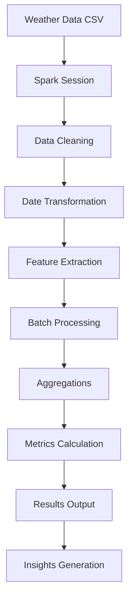

# Spark Weather Analysis Workflow

## Process Steps

1. **Data Input**: Load weather data from CSV file
2. **Session Init**: Create Spark distributed computing session
3. **Data Cleaning**: Remove nulls and duplicates
4. **Transformation**: Convert dates and extract components
5. **Feature Extraction**: Derive additional columns
6. **Batch Processing**: Analyze complete dataset
7. **Aggregations**: Calculate min/max/avg temperatures
8. **Metrics**: Generate statistical measures
9. **Output**: Display results in tabular format
10. **Insights**: Provide analytical conclusions

## Key Technologies

- Apache Spark for distributed processing
- PySpark for Python integration
- SQL-like operations for data manipulation
- Window functions for trend analysis